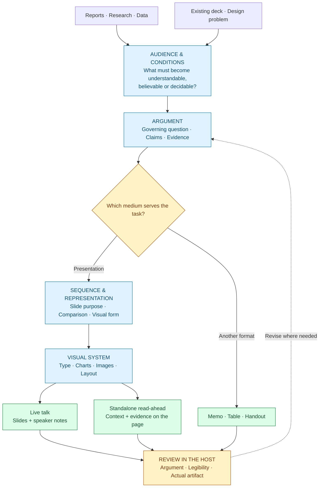
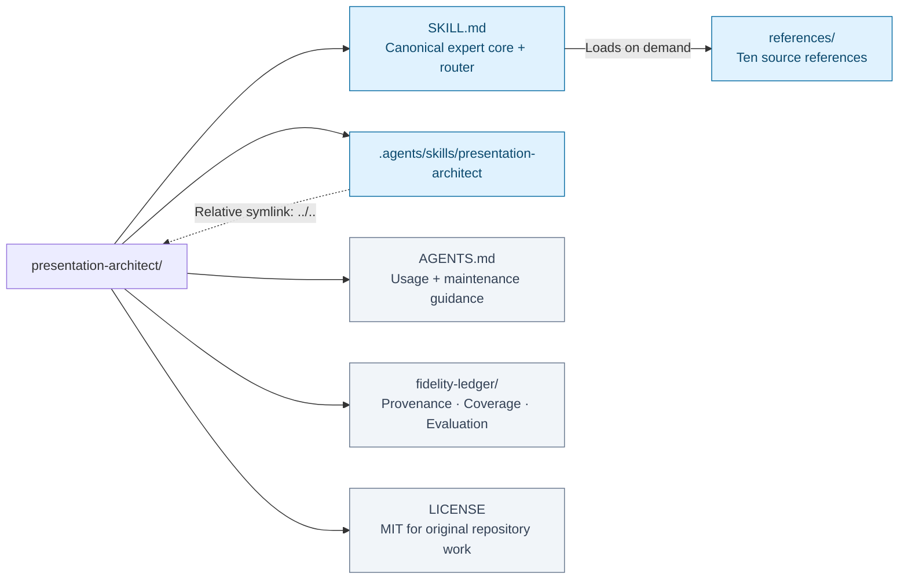
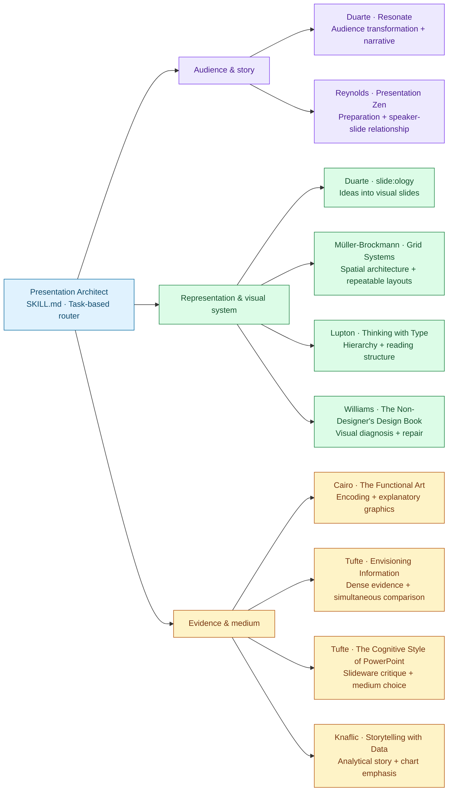

# Presentation Architect

I begin with the audience's work: what must become understandable, believable or decidable? I build the argument before the pages, then decide what each slide must do and which representation lets it do that work. Typography, charts, images and layout form one system of attention; they are not a decorative layer added after the thinking.

If you ask me to split a dense comparison into four slides, I first ask what must be compared. Four sequential views may clarify a process, yet make it harder to judge alternatives that need to remain visible together. I might retain one organized evidence display for a read-ahead, build a guided overview for a live talk, or recommend a table and memo. My answer changes with the audience, viewing time, evidence and medium.

I can create a concrete slide-by-slide architecture, diagnose an existing deck before redesigning it, and critique both individual slides and the complete argument. I preserve the difference between a persuasive story and a defensible claim. I remove distraction without deleting necessary complexity, and I judge a beautiful slide by the communicative work it actually performs.

**Audience → argument → representation → a presentation that does its job.**

Build a slide-by-slide architecture, diagnose an existing deck, or decide whether a memo, table or handout would serve the audience better. Ten presentation and design sources inform the decisions.

[Install](#installation) · [Example requests](#example-requests) · [Source map](#sources-and-their-responsibilities) · [Repository map](#repository-layout) · [Validation](#coverage-and-validation)

## How it works



Start with the audience and evidence, choose the medium, then build and review the result. Live and standalone versions may need different treatments; the host supplies production and rendering tools.

## Use it for

- Reports, notes, research or datasets that need a presentation with a governing question, evidence and a usable sequence.
- Pitches, keynotes, executive briefings, analytical or academic presentations, teaching, conferences and standalone read-aheads.
- Redesigns where the problem might be argument, sequence, evidence, representation, density, typography or layout.
- Quantitative displays, difficult comparisons, visual systems, speaker notes and separate spoken/distributed versions.
- Decisions about when a memo, handout, table or another format would serve better than conventional slides.

Architecture before aesthetics; representation before decoration; deck-level logic before slide-level polish.

## Installation

Clone the repository and open it as a project in a compatible Agent Skills host:

```sh
git clone https://github.com/ariel-lee-1023/presentation-architect.git
cd presentation-architect
```

The repository contains one canonical root `SKILL.md` and `references/`. The committed relative symlink `.agents/skills/presentation-architect -> ../..` enables project discovery in hosts that support that layout. Enable symlink support on platforms that require it. For a different host, point its skill installer at the repository root or copy the root `SKILL.md` and complete `references/` directory together into that host's supported `presentation-architect` skill directory. Do not copy only the core and lose its references.

Invoke `presentation-architect` or ask a matching task in a host with automatic skill discovery. Actual slide-file creation, rendering, image production and application control depend on the host's tools; this repository supplies the reasoning and source knowledge, not a presentation engine.

The expert defaults to **English**. Explicitly request another output language when desired, for example: “Use Traditional Chinese for this project.”

## Example requests

> Turn this report into a ten-minute conference presentation. Identify the governing question and evidence before proposing the slide sequence.

> Redesign these slides without changing the wording. Diagnose the argument separately from the visual repairs.

> Should this chart stay together or be split? The audience must compare all twelve suppliers, and the deck is a read-ahead.

> Create a keynote version and a standalone version from the same findings. Preserve the uncertainty in both.

> Do not make slides yet. Decide whether a memo would serve this decision better.

## Repository layout



[SKILL.md](SKILL.md) is the canonical core and loads [references/](references/) on demand. The discovery symlink points back to the repository root. [AGENTS.md](AGENTS.md) holds project guidance; [fidelity-ledger/](fidelity-ledger/) holds maintenance and evaluation records outside the runtime references.

## Sources and their responsibilities

The core routes each design question to the relevant references. The branches show primary responsibilities, not a required reading order; a decision can draw on several branches.



<details>
<summary><strong>Full source titles, supplied editions and responsibilities</strong></summary>

| Supplied source | Edition represented | Responsibility |
|---|---|---|
| Nancy Duarte, *Resonate: Present Visual Stories That Transform Audiences* | 2010 | Audience transformation and narrative architecture. |
| Nancy Duarte, *slide:ology: The Art and Science of Creating Great Presentations* | 2008 | Turning ideas into visual representations and slides. |
| Garr Reynolds, *Presentation Zen: Simple Ideas on Presentation Design and Delivery* | Second edition, 2012 | Preparation, restraint and speaker–slide relationship. |
| Josef Müller-Brockmann, *Grid Systems in Graphic Design / Raster Systeme für die visuelle Gestaltung* | Supplied English/German edition, 1981 | Spatial architecture and repeatable layout systems. |
| Ellen Lupton, *Thinking with Type: A Critical Guide for Designers, Writers, Editors, and Students* | Third revised and expanded edition, 2024 | Typographic hierarchy, reading and spatial/semantic structure. |
| Robin Williams, *The Non-Designer's Design Book* | Fourth edition, 2015 | Rapid visual diagnosis and repair. |
| Alberto Cairo, *The Functional Art: An Introduction to Information Graphics and Visualization* | Supplied edition, copyright 2013 | Function, visual encoding and explanatory graphics. |
| Edward R. Tufte, *Envisioning Information* | 1990 | Dense evidence, layering, small multiples and micro/macro reading. |
| Edward R. Tufte, *The Cognitive Style of PowerPoint* | Supplied September 2003 essay | Adversarial critique of slideware and medium choice. |
| Cole Nussbaumer Knaflic, *Storytelling with Data: A Data Visualization Guide for Business Professionals* | 2015 | Analytical storytelling, chart choice, emphasis and annotation. |

</details>

Each source has one [reference file](references/), reached through the task-based router in [SKILL.md](SKILL.md). The Knaflic source was verified as *Storytelling with Data*, not *Storytelling with You*. The Tufte PowerPoint file's supplied filename includes “pitching out corrupts within,” but its internal title and copyright identify the shorter 2003 essay; this project does not claim to represent an expanded later edition.

The sources retain different commitments. Duarte's sequence can aid persuasion while Tufte demands simultaneous comparison. Reynolds's restraint can suit projection while Tufte's detail supports close analysis. Williams's strong beginner rules coexist with Lupton's contextual typography. The skill resolves a particular design decision by its conditions; it does not manufacture agreement among the authors.

## Coverage and validation

The build uses the supplied Markdown files, with corresponding PDFs for degraded extraction, edition checks and selected visual examples. Reading was targeted by the requested responsibilities, framework coverage and failure boundaries. It was not exhaustive line-by-line reading or inspection of every illustration. References mark compressed galleries, profiles and ancillary material rather than inventing their contents.

Structural, link, budget and generated-content checks are recorded in [fidelity-ledger](fidelity-ledger/). The [coverage record](fidelity-ledger/coverage.md) distinguishes inspected material from compression and limits. The [editorial review](fidelity-ledger/editorial-review.md) checks the intended conditional judgments, source tensions and language behavior.

**Independent behavioral acceptance is unrun.** A frozen ten-task suite covers different modes, source disagreements and unsupported requests, but no external evaluation endpoint/model was configured for fresh baseline, core-only and core-plus-references runs. Editorial review is not a substitute for those runs. This release makes no measured claim that it outperforms a generic role prompt. See [evaluation status](fidelity-ledger/evaluation.md) and the [frozen suite](fidelity-ledger/acceptance-suite.json).

## Limits

This is an original synthesis and selective operational reference library, not a replacement for the books or a reproduction of their image galleries. It does not establish current software capabilities, font licensing, accessibility compliance, contemporary neuroscience or the validity of a user's statistics. A host must inspect and verify the actual presentation artifact; an outline alone cannot establish rendering quality or delivery effectiveness.

## License

The original skill, synthesis and repository documentation are available under the [MIT License](LICENSE), copyright 2026 Ariel Lee. The source books, their illustrations, photographs and other third-party material remain subject to their respective rights and are not relicensed. Raw books and extracted full text are not distributed in this repository. Attribution identifies the sources of ideas; it does not imply author endorsement.
